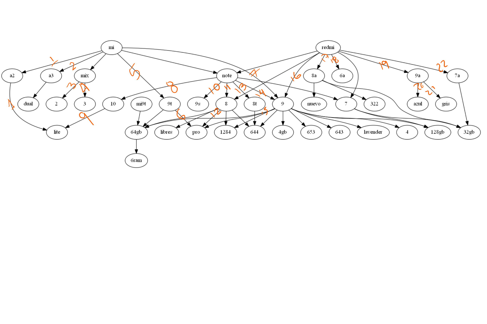
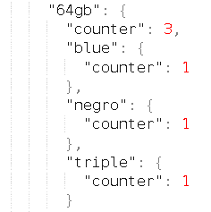

# Meli-Scraper
This project aims to scrap data from MELI (Mercado Libre). The main idea is to identify unique products from a search, for example, different models and colors from Xiaomi products.

The process for this implementation is:

1. Scrap the MELI page
2. Create the tree based in the texts that have been filtered
3. A graph is exported for validation purposes
4. Count products from the generated tree

# Development process
## 1. Visual Classification
The first approach was creating a tree and then ploting the info to count manually the number of products.
This count gave 22 different products with general characteristics.

Nevertheless, this process is not automatic and produces information lost. For example, the scraping process extracts 2 MI 10 phones and 1 MI 10 lite phones, the manual analysis could prone errors since the interpretation is having only one model MI 10 lite.

To solve this, an automatic approach was created. The approach is found in the next section.

## 2. Tree filtering by number of products
Using this approach the number of products discovered was 195. Nonetheless, an analysis shows that the algorithm is affected by irrelevant info by words position, as can be seen in the next image.

To solve this a filtering enhancement is proposed, this enhancement is presented in the next section.
## 3. Filter enhancing
The first and second versions of the algorithm cleaned the products by deleting stop words and other repetitive and not meaningful words. The new approach focused on keeping the relevant words instead of creating a list with the nonimportant ones, these words belong to three categories:
* The words from the Xiaomi models scraped from GSMArena
* Colors in English and Spanish
* Gigabyte combinations from MELI scraping

Using this approach the algorithm produced 113 products.

## pros
* The process is very straight forward to use
* The logic allows product filtering based in important words provided by experts or extracted from the web.
* Since the structure can be used into a graph data structure it's possible to use network logics to get products insights.

## cons
* Some data is lost due to the usage of deep graph levels.
* the main problem with this approach is that it relies on the text order. For example, if the same model is presented in two publications but one product has the ram capacity before the memory one, the algorithm will count it as two different products.

## TODO
* Work in a strategy to stop relying on the text's components order.
* Since the tree can be really big it could be interesting to test parallelization techniques for processing elements in the future.
* The usage of ML techniques for this problem could be tested. Techniques such as TF-IDF and n-grams were tested but were not useful since they find relevant terms and not clustering. Clustering techniques such as DBScan were evaluated but not implemented due to time constraints.
* Improve the testing and exception handling.