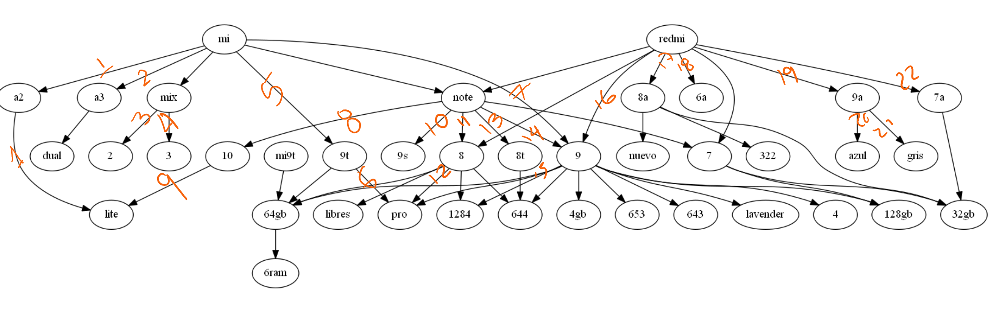

# Meli-Scraper
This project aims to scrap data from MELI (Mercado Libre). The main idea is to identify unique products from a search, for example, different models and colors from Xiaomi products.

The process for this implementation is:

1. Scrap the MELI page
2. Create the tree based in the texts that have been filtered
3. A graph is exported for validation purposes
4. Count products from the generated tree

# Results
## Visual Classification
The first approach was creating a tree and then plot the info to count manually the number of products.
This count gave me 22 different products with general characteristics.

Nevertheless, this process is not automatic and you lose information about the real unique characteristics. For example, if you have 3 mi 10 phones and 1 of those 3 phones is the lite version you can not see that.

One way to improve this is to have a counter with the number of products you want to generate.

## Tree filtering by number of products
Since having a visual analysis is not the expected behavior, the tree generation logic was enhanced to stop the leaf analysis when the number of products in the edge (the connection between nodes) is one. This logic makes sense since you will not expect more counters in that leaf.
This way the number of products was 195, an analysis shows that errors like

Meaning that the tree was affected by irrelevant info. So the next iteration was to enhance filtering.
## Filter enhancing
The filtering for the first and second versions was deleting stop words and some selected words I noticed were not important. With this new approach I focused on keeping the important words, which are:
* The words from the Xiaomi models scraped from GSMArena
* Colors in English and Spanish
* Gigabyte combinations from MELI scraping
With this filtering, the algorithm produced 113 products.

The next steps for the algorithm enhancements are showed in the TODO section.

## pros
* The process is very straight forward to use
* The logic allows product filtering based rules specified by data extracted from the web.
* You can add characteristics based on web or expert knowledge , optimizing algorithm behavior.
## cons
* Some data is lost due to the usage of deep graph levels
* It's necessary to figure out other filter approaches.
* the main problem with this approach is that it relies on the text order. For example, if you have the same model in two publications but one product has ram before memory the algorithm will count it as two different products.

## TODO
* Work in a strategy to stop relying on the text's components order.
* Since the tree can be really big it could be interesting to test parallelization techniques for processing elements in the future.
* I tried to use some ML techniques for this but it was complicated due to the difference of names and formats. Techniques such as TF-IDF and n-grams were not useful since they find relevant terms and not clustering. Clustering techniques such as DBScan were evaluated but not implemented due to time constraints.
* Testing